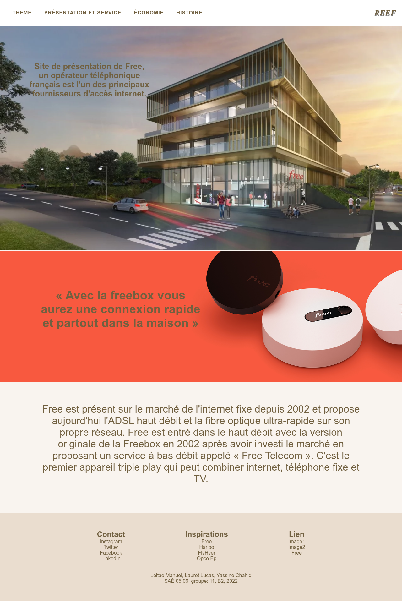
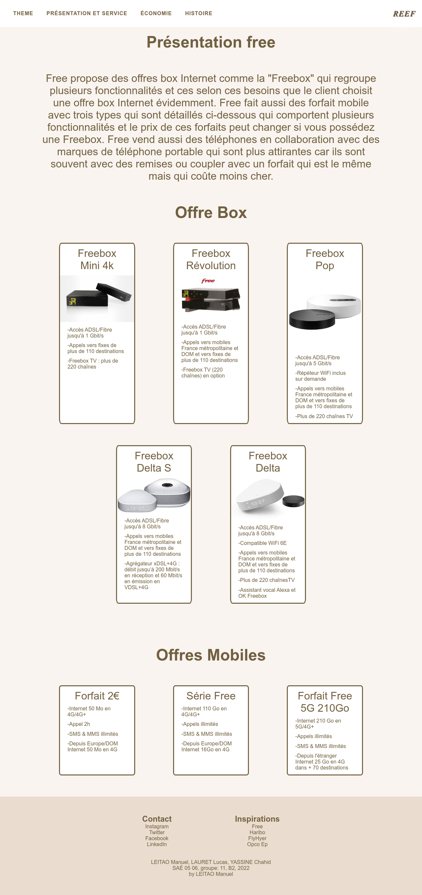
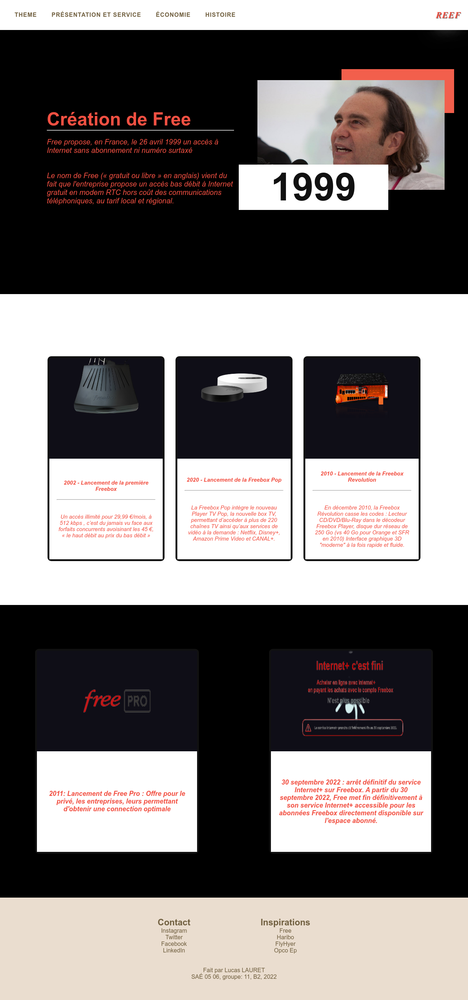

# S1-2022-ihm SAE 0506
## Groupe numéro : 11

Bienvenue sur le github de reef (pour ne pas nous confondre avec free) voici un site qui présente l'entreprise free avec ces services, son histoire et son économie.

Le site possède un thème sombre et clair sur la majorité des pages, les pages sont aussi responsives pour la majorité. Nous avons séparé site en plusieurs pages avec chacun une ou plusieurs pages a faire et les tâches :  
  
LAURET Lucas : Page Histoire, réalisation du README.md.  
YASSINE Chahid : Page Economique, principal acteur du rapport économique.  
LEITAO Manuel : Page d'accueil et service, très petit acteur du rapport économique, finalisation du README.md.  

* Etudiant 1 (Référent du groupe) : Manuel LEITAO : manuel.leitao@edu.univ-fcomte.fr  
  
* Etudiant 2 : Lucas LAURET : lucas.lauret@edu.univ-fcomte.fr son lui github : [Github](https://github.com/llauret-iut90)
   
* Etudiant 3 : Chahid YASSINE -Mail: chahid.yassine@edu.univ-fcomte.fr. son lien github :  [Github](https://github.com/cyassine-iut90 ) 

l'URL du site github page : [Lien](https://mleitao2-iut90.github.io/s1-2022-ihm/)  
l'URL du projet github : [Lien](https://github.com/mleitao2-iut90/s1-2022-ihm)  
Aller sur le pdf de W3C : [Lien](https://github.com/mleitao2-iut90/s1-2022-ihm/blob/main/doc/rapport%20W3C.pdf)  
L'URL pour aller voir le site officiel de [free](https://www.free.fr/freebox/)(si nous vous avons convaincu).

### Zoning général (Tous): 

### Page d'accueil (Manuel LEITAO):

### Page des services (Manuel LEITAO) :

### Histoire (Lucas LAURET) :

