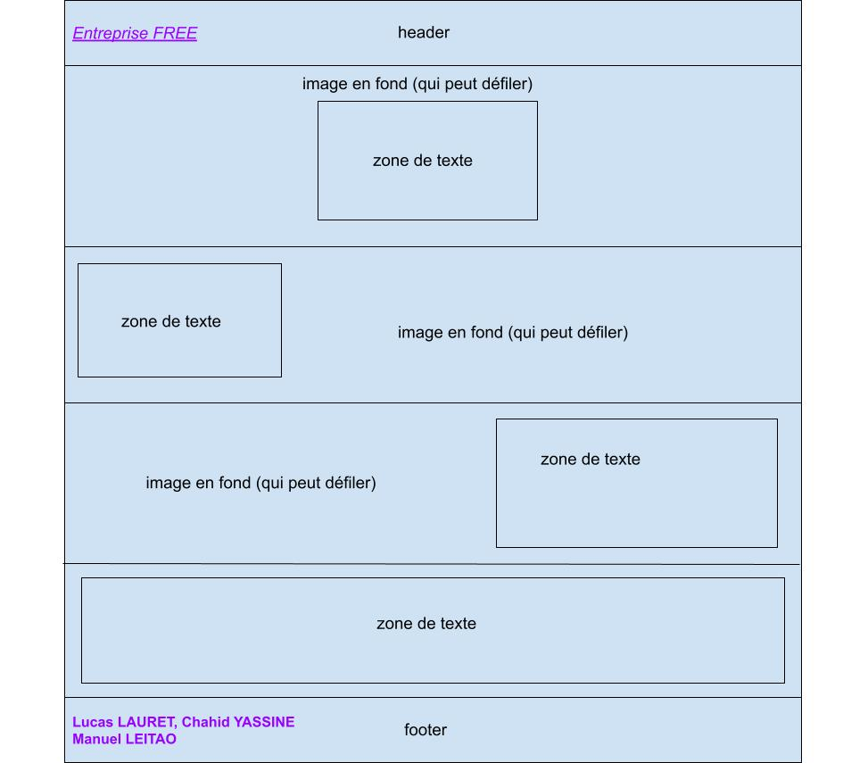
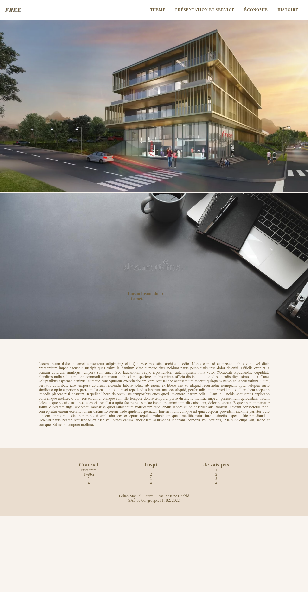

# S1-2022-ihm SAE 0506
## Groupe numéro : 11
* Etudiant 1 (Référent du groupe) : Manuel LEITAO : manuel.leitao@edu.univ-fcomte.fr  
  
* Etudiant 2 : Lucas LAURET : lucas.lauret@edu.univ-fcomte.fr [Github]: https://github.com/llauret-iut90
   
* Etudiant 3 : Chahid YASSINE -Mail: chahid.yassine@edu.univ-fcomte.fr. [Github]: https://github.com/cyassine-iut90  

l'URL du site github page : https://mleitao2-iut90.github.io/s1-2022-ihm/  
l'URL du projet github : https://github.com/mleitao2-iut90/s1-2022-ihm 

### Zoning général : 

### Page d'accueil :

